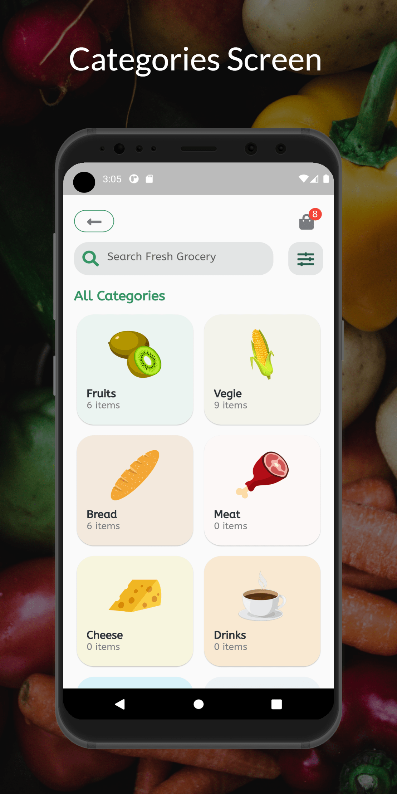
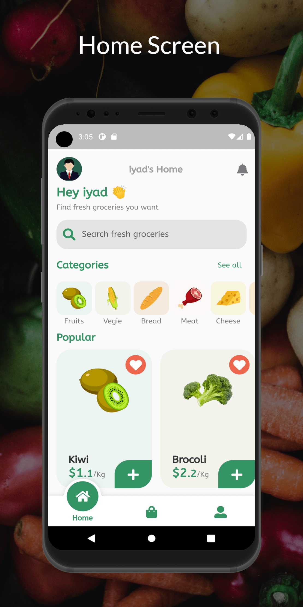

# grocery_shop
Ecommerce shop app to sell groceries using flutter and firebase 
this app is developed with MVC archetecture , state management with Getx 
# Screens
- Splash screen
- on boarding screen
- login and signup screen
- categories screen
- products screen
- product detail screen
- bag screen
- favorites screen
- user screen 
- edit profile screen
- change password screen
# ScreenShots

